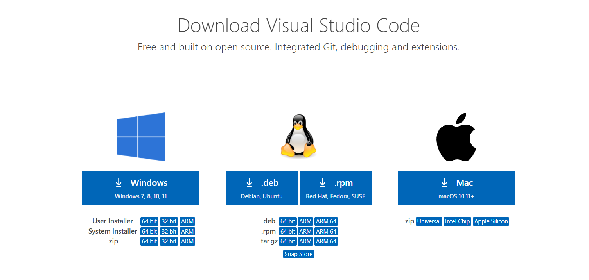
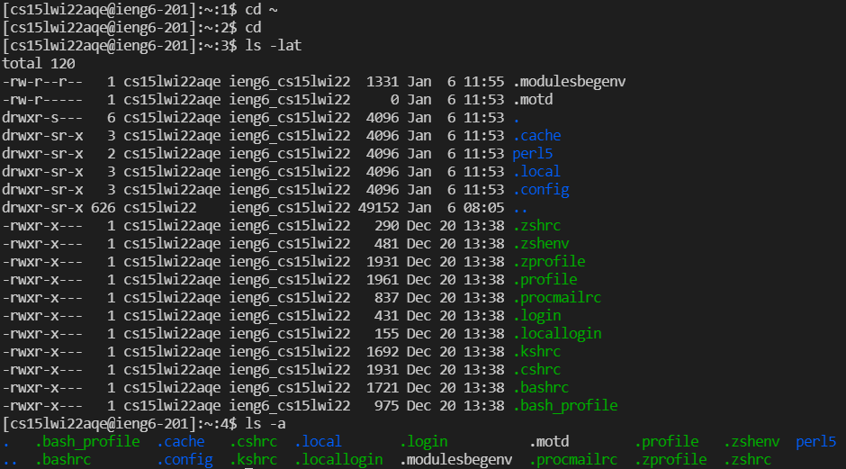
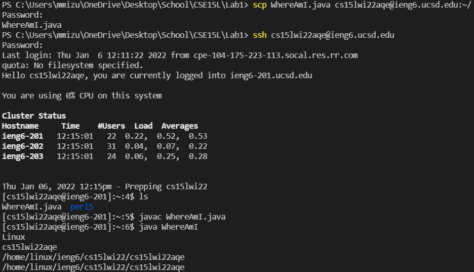
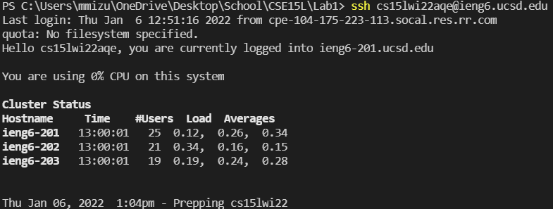
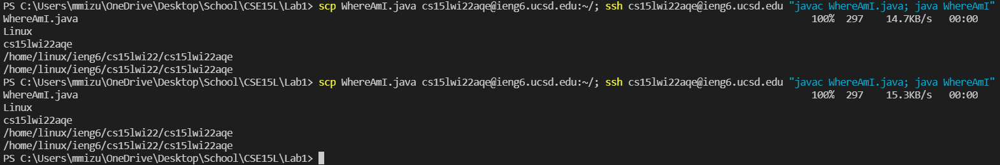

The first step about how to log into a course-specific account on ieng6 is to install VScode. To do this search up VSCode in your browser and click on the download.

On this website you should click the download button for your operating system and install VSCode.

The next step to logging into a course-specific account is to install OpenSSH.

To install open SSH you should open settings > Apps > Apps and Features > Optional Features. 
Once you are here you should make sure you have OpenSSH installed and if you do not find and install OpenSSH client and OpenSSH server.

After you have OpenSSH go to look up your course-specific CSE15L account and create your password.
After you have set up your account and password you can log into your account in VSCode.

Once you are in VSCode you can type the command `ssh cse15lwi22aqe@ieng6.ucsd.edu` except `aqe` will be replaced by letters in your course-specific account
Then enter your password to login into the remote server.

Once you have logged in you can test out some commands.

Here we test the commands `cd` and `ls`
The `cd` does not print anything and the `ls` command lists some files.

Once you have tried testing some commands you can create a file and add some code.
Then you can upload the file to the remote server with the `scp` command and run your code.

As we can see in the picture when we run `ls`, the file WhereAmI.java has been uploaded to the remote server and can be run.

As we get more used to using the remote server entering our password every time we want to login or upload a file can get repetitive.
To skip this step we can create a SSH key with the command `ssh-keygen` to skip the step of having to enter our password
When you run this command you need to enter the file in which you want to save the key and can leave no passphrase.
Once you have done this you should be able to login to the remote server without having to enter a password

Some other things you can do to optimize running is to compress all the commands that you run into a single line.
You can do this because after you type `ssh cse15lwi22aqe@ieng6.ucsd.edu` you can enter the command you want to run in quotes to login to the remote server run the command and logout.
You can also write mutliple commands in a single line by using a semicolon to separate commands.
Lastly you can use the up arrow to reuse past commands you have written
With this information you can signifcantly reduce the amount of time you spend having to test your code.

