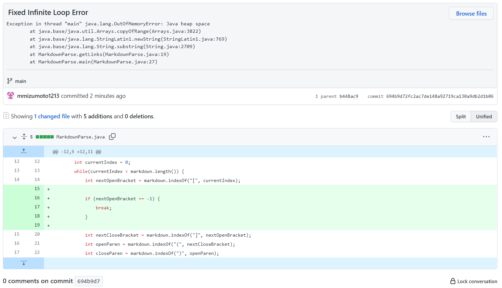
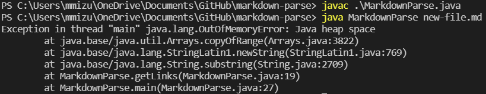
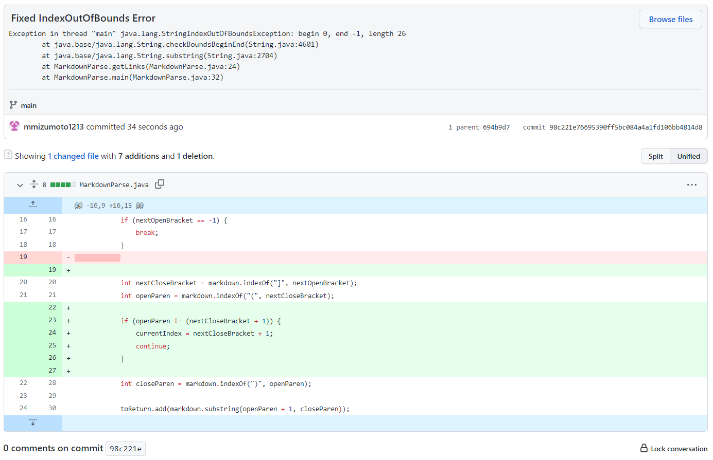
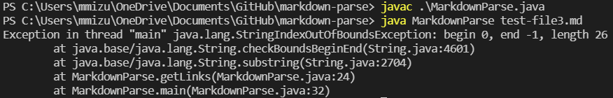
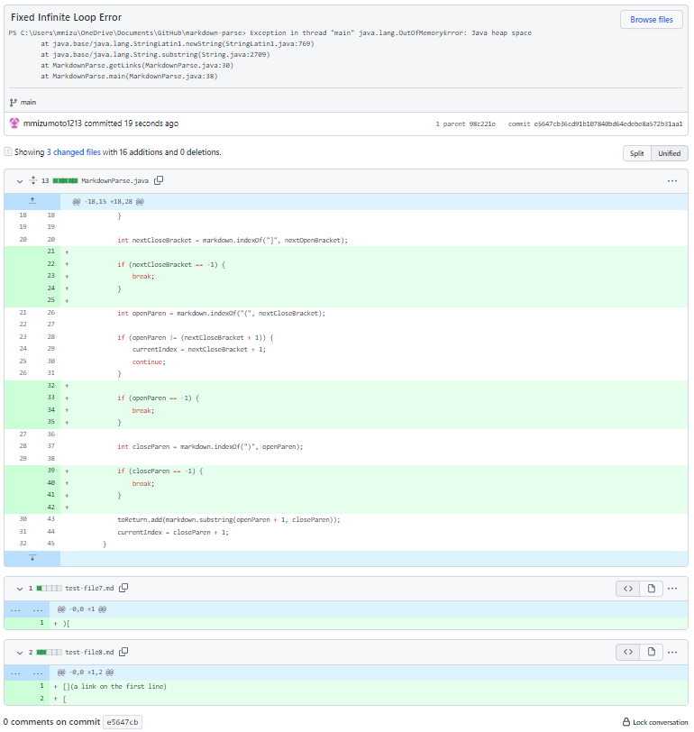
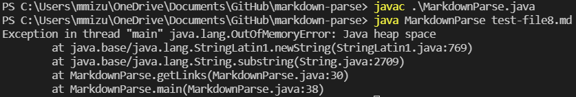

# Week 4 Lab Report

## Error 1

[Failure-Inducing Test File](new-file.md)

The symptom of this error was an infinite loop occuring in the while loop in the method getLinks. The bug causing this infinite loop was that the while loop would continue 
as long as currentIndex was less than markdown.length, however currentIndex would only be updated when closing parenthesis was found. This means that files that did not end
with closing parenthesis caused an infinite loop to occur.

## Error 2

[Failure-Inducing Test File](test-file3.md)

The symptom of this error was an IndexOutOfBoundsException that would occur when there were brackets being used without parenthesis being used afterwards. The bug causing this 
exception was that the code would search for a open parenthesis somewhere after the bracket was used but the open parenthesis does not exist. This made the program continuously
search for indexes after the bracket appeared until it reached an index that does not exist in the file.

# Error 3

[Failure-Inducing Test File](test-file8.md)

The symptom of this error was another infinite loop occuring in the while loop in the method getLinks. This bug causing the infinite loop was an opening bracket being found 
in the file, however nothing else was found afterwards. The currentIndex only updates when an index for a closing parenthesis is found so this caused the while loop to loop
infinitely.
