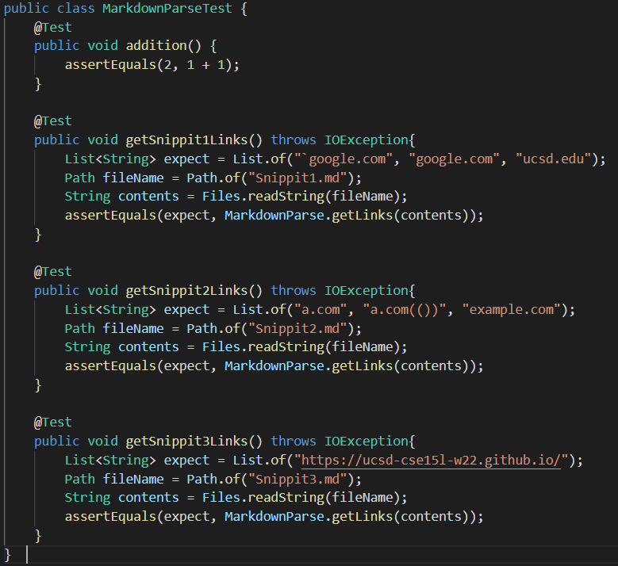
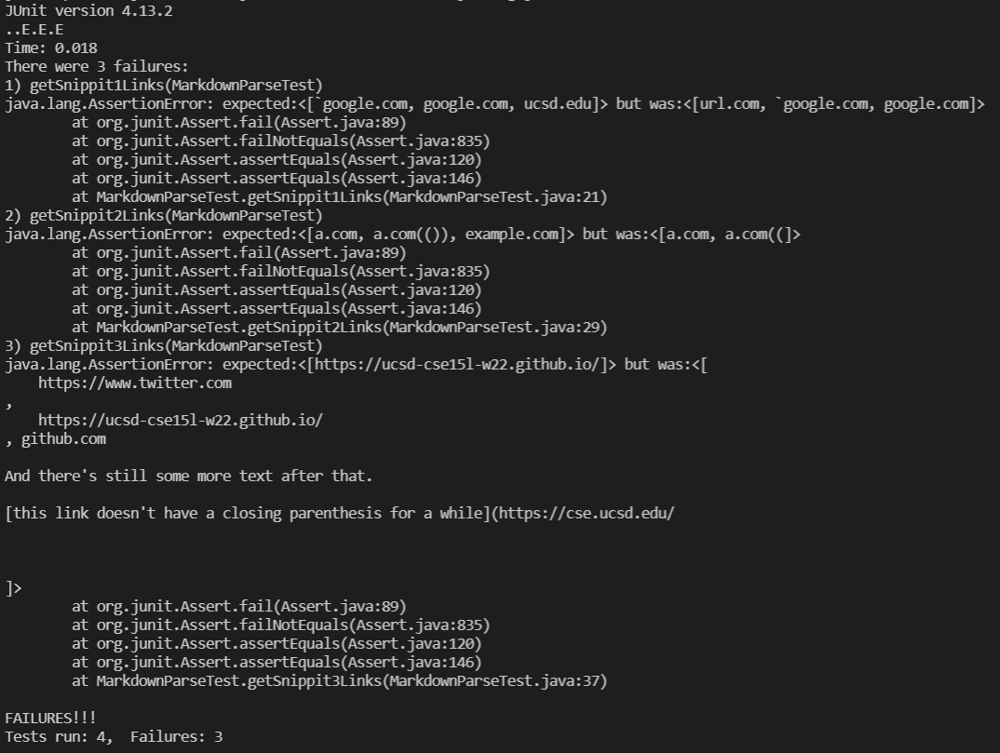
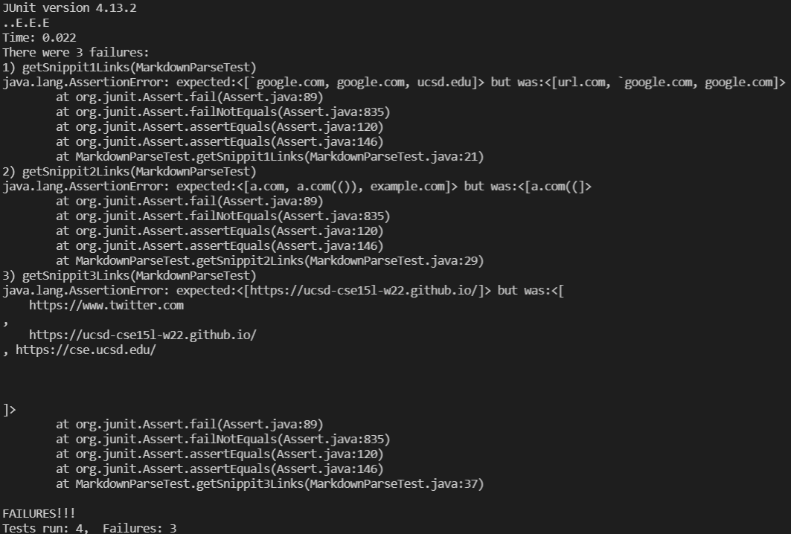

## Week 8 Lab Report

# A link to my markdown-parse repository and a link the one I reviewed
[My Github Page](https://github.com/mmizumoto1213/markdown-parse)

[Viewed Github Page](https://github.com/christopherthomason/markdown-parse)

# Tests

Showing the code in `MarkdownParseTest.java` for how I turned it into a test

Corresponding output for my MarkdownParse

Corresponding output for the viewed MarkdownParse

# Answering the questions with 2-3 sentences each

For snippit 1 I think it would be possible to fix this problem with a small code change.
All this would require is to implement another variable that checks for `%60` and ensure
it does not overlap with any brackets or opening parenthesis used for the link syntax. 
We should be able to implement this relatively easily in a slightly similar way we check
for the opening and closing brackets and parenthesis.

For snippit 2 I think it would be difficult to fix this with a small code change. For this we
could create a method similar to the findCloseParen that was in the `MarkdownParse.java` of
the example code the week 8 lab "Using a Debugger" section. However, as we saw, implementing this 
method requires more than 10 lines of code.

For snippit 3 I think it would be difficult to fix this issue with a small code change. For 
this issue we need to look at if there is more than one consecutive /n any part of the brackets or
the parenthesis, and we need to trim any single /n we find in the within the link before or after the
link within the parenthesis. To do this, it would definitely require more than 10 lines of code so
we would not be able to fix this with a small code change.
