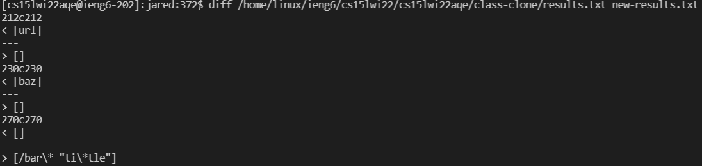
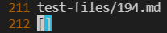
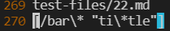
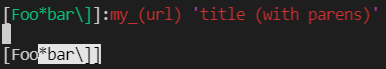
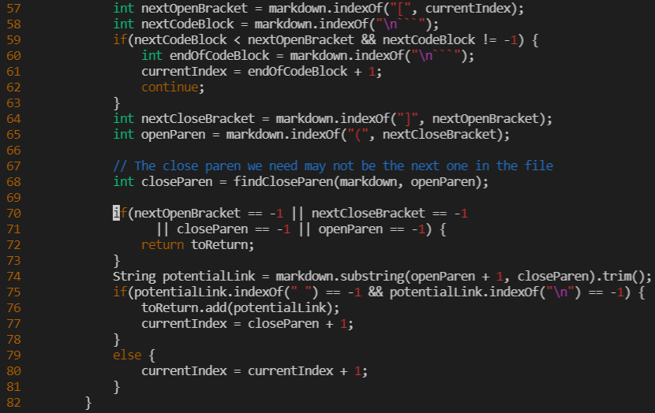
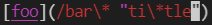
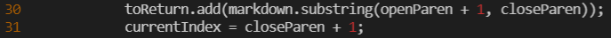

## Week 10 Lab Report

# Two Tests

The two tests I chose for this lab report are tests that produced the output on lines 212 and 270. 

# Explain:
# Part 1
In our lab we found the differences between our outputs using `diff`. We ran the command `diff /home/linux/ieng6/cs15lwi22/cs15lwi22aqe/class-clone/results.txt new-results.txt`
to print out all of the outputs where our code produced a different output from the given code. From here we knew which lines in new-results.txt produced the differences so we
looked inside new-results.txt using vim and found the lines where our output was different. We also found the corresponding test file to that output on the line above it.

Now that we know which tests failed we are able to look inside these test files to see the problem.

# Part 2

The code that was given produces the output `url` after running this test.

The expected output from running test 194 is an empty list. This is because test file 194 is not following the format of a file. The issue in the given code is that it is only
ensuring that open brackets, closing brackets, open parenthesis, and closing parenthesis are in the file (Line 70-73). It is not checking that the closing bracket is
next to the open parenthesis. There should be another if statement after line 73 that also checks that the closing bracket comes right after the open parenthesis.

Our code produces the `output /bar\* "ti\*tle"` after running this test.

The expected output from running test 22 is an empty list. This is because there is a space inside the parenthesis in between text. The issue in our code is that we do not check
for spaces in between text inside of our links. We can fix this by adding an if statement before we add the potential link to our list.
